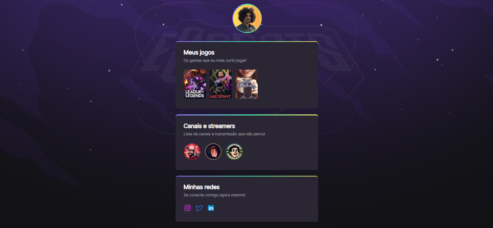

# NLW eSports 

>Trilha explorer

Projeto construído no evento Next Level week da Rocketseat.

🔗 [Clique aqui para acessar](https://kaiojesus.github.io/NLW-eSports-Explorer/)

## 🛠 Tecnologias 

- Html
- Css
- Git e GitHub

## 📘 Aprendizado

Ao longo dessa semana, aprendi comandos em HTML, CSS, git e GitHub pelo evento da Nlw. 

Uma coisa que poderia ser melhor explicada seria o git, eu por exemplo não tinha instalado e tive que buscar ajuda por fora para conseguir configurar e pôr tudo no repositório

## ✉ Contato

kaiojesus@gmail.com
